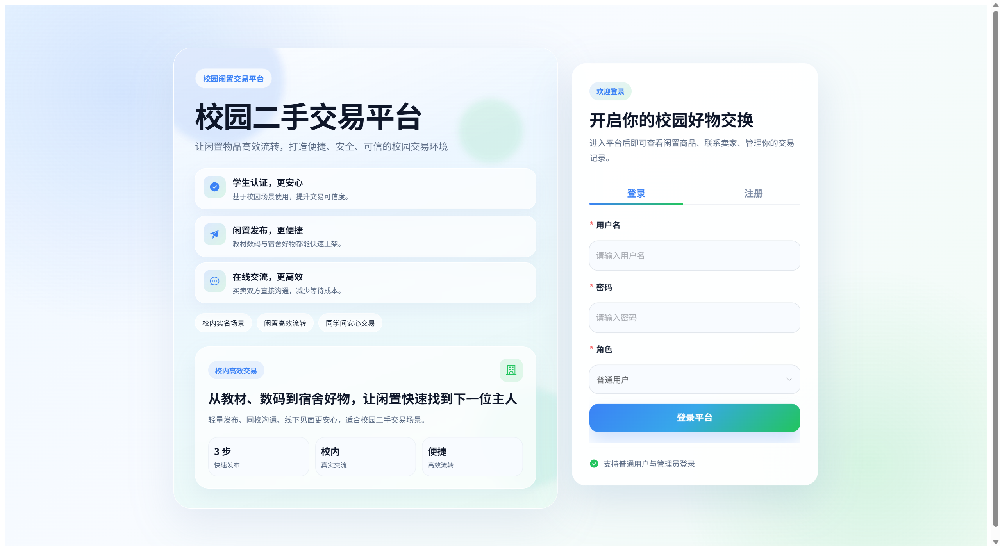
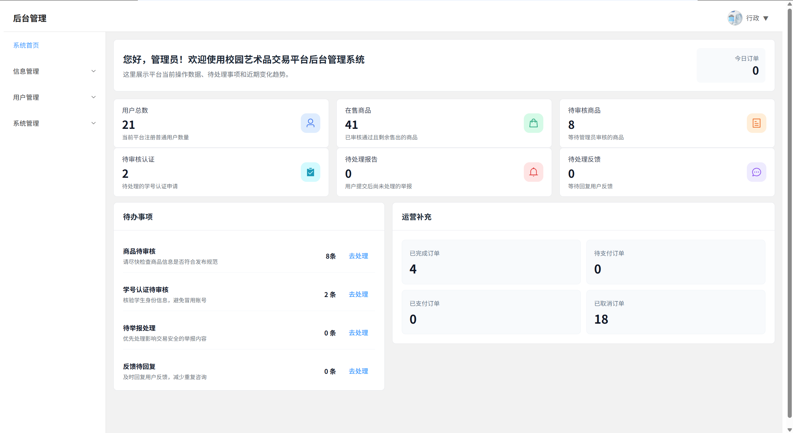

# 校园二手交易平台

一个面向校园场景的二手交易平台，支持学生用户发布闲置商品、浏览商品、收藏、下单、评价、求购、站内消息、实名认证与信用记录管理；后台提供商品审核、订单管理、用户管理、举报处理、公告维护、系统配置等管理功能。项目采用前后端分离架构，适合作为毕业设计、课程设计或 Spring Boot + Vue 综合实践项目。

## 项目简介

本项目围绕校园二手交易业务展开，主要解决校园内闲置物品发布、检索、交易沟通、订单流转和后台审核管理等问题。

系统分为用户端和管理员端：

- 用户端：面向普通学生用户，提供商品浏览、商品详情、发布商品、我的订单、我的收藏、求购信息、站内聊天、反馈、举报、实名认证、信用中心等功能。
- 管理端：面向管理员，提供数据看板、分类管理、商品管理、订单管理、求购管理、公告管理、用户管理、管理员管理、认证审核、举报处理、反馈处理、信用管理和系统设置等功能。

## 技术栈

### 后端

- Java 17
- Spring Boot 4
- Spring Web
- Spring Data JPA
- MySQL
- Lombok
- BCrypt 密码加密
- Maven

### 前端

- Vue 3
- TypeScript
- Vite
- Vue Router
- Axios
- Element Plus

### 开发与部署

- 前后端分离开发
- Vite 开发代理转发 `/api` 和 `/upload`
- Git / GitHub 版本管理

## 主要功能

### 用户端功能

- 用户注册、登录和会话校验
- 首页热门商品浏览
- 商品详情查看、收藏、点赞、举报
- 商品发布、编辑、下架与个人商品管理
- 求购信息发布与管理
- 订单确认、购买记录、出售记录、订单状态管理
- 收货地址管理
- 用户个人资料维护
- 站内聊天与交易沟通
- 公告查看、意见反馈
- 学生实名认证
- 信用积分与信用记录查看

### 管理端功能

- 后台数据看板
- 商品分类管理
- 商品审核、上下架和商品信息管理
- 订单管理
- 求购管理
- 公告管理
- 用户管理
- 管理员账号管理
- 学生认证审核
- 举报处理
- 用户反馈处理
- 信用积分调整与信用日志查看
- 系统基础配置管理

## 前后端启动方式

### 环境要求

- JDK 17+
- Maven 3.8+
- Node.js 18+
- MySQL 8+

### 后端启动

1. 创建 MySQL 数据库：

```sql
CREATE DATABASE campus_trade DEFAULT CHARACTER SET utf8mb4 COLLATE utf8mb4_unicode_ci;
```

2. 配置数据库连接。项目默认读取以下环境变量：

| 变量名 | 说明 | 默认值 |
| --- | --- | --- |
| `SERVER_PORT` | 后端服务端口 | `8082` |
| `DB_URL` | MySQL 连接地址 | `jdbc:mysql://localhost:3306/campus_trade?...` |
| `DB_USERNAME` | 数据库用户名 | `root` |
| `DB_PASSWORD` | 数据库密码 | 空 |

Windows PowerShell 示例：

```powershell
$env:DB_USERNAME="root"
$env:DB_PASSWORD="你的数据库密码"
.\mvnw.cmd spring-boot:run
```

后端默认访问地址：

```text
http://localhost:8082
```

### 前端启动

进入前端目录并安装依赖：

```powershell
cd campus-trade-vue
npm install
npm run dev
```

前端默认访问地址以 Vite 控制台输出为准，通常为：

```text
http://localhost:5173
```

前端开发环境会将 `/api` 和 `/upload` 代理到后端服务，默认目标为：

```text
http://localhost:8082
```

如需修改代理目标，可在 `campus-trade-vue/.env.local` 中配置：

```env
VITE_DEV_PROXY_TARGET=http://localhost:8082
```

## 数据库初始化方式

当前仓库中包含的数据库脚本：

```text
src/main/resources/schema.sql
```

注意：该文件是局部兼容脚本，文件头部已说明它不是完整数据库初始化脚本。完整运行项目时，需要准备完整的表结构和初始数据脚本，并导入到 `campus_trade` 数据库。

推荐初始化流程：

1. 新建数据库 `campus_trade`。
2. 导入完整数据库初始化 SQL，包括用户表、商品表、订单表、分类表、聊天表、举报表、认证表、信用表、系统配置表等业务表。
3. 如只需要补充当前仓库已有的局部兼容表，可执行：

```powershell
mysql -u root -p campus_trade < src/main/resources/schema.sql
```

4. 修改或设置数据库连接环境变量后启动后端服务。

建议将完整初始化脚本整理到以下路径，便于后续维护和展示：

```text
docs/database/init.sql
```

## 系统截图

建议将真实运行截图放到 `docs/images/` 目录，并在 README 中展示。推荐截图包括：

| 页面 | 建议文件名 | 说明 |
| --- | --- | --- |
| 登录注册页 | `docs/images/auth.png` | 展示用户登录、注册入口 |
| 用户首页 | `docs/images/user-home.png` | 展示热门商品、商品列表 |
| 商品详情页 | `docs/images/product-detail.png` | 展示商品信息、收藏、购买、举报 |
| 个人中心 | `docs/images/user-center.png` | 展示个人资料、订单、商品管理 |
| 后台数据看板 | `docs/images/admin-dashboard.png` | 展示后台统计数据 |
| 商品管理 | `docs/images/admin-products.png` | 展示商品审核与管理 |
| 订单管理 | `docs/images/admin-orders.png` | 展示订单列表和状态管理 |

截图补充后，可以按下面格式展示：

```md



```

## 项目结构

```text
twohand
├── campus-trade-vue/          # Vue 3 前端项目
│   ├── src/api/               # 前端接口封装
│   ├── src/views/             # 用户端和管理端页面
│   ├── src/layouts/           # 页面布局
│   └── vite.config.ts         # Vite 配置和代理配置
├── src/main/java/com/campus/  # Spring Boot 后端源码
├── src/main/resources/        # 后端配置和 SQL 脚本
├── pom.xml                    # Maven 配置
└── README.md                  # 项目说明文档
```

## 说明

本项目为毕业设计项目，重点展示前后端分离开发、校园交易业务建模、用户端交易流程、后台管理流程和基础权限控制等能力。
